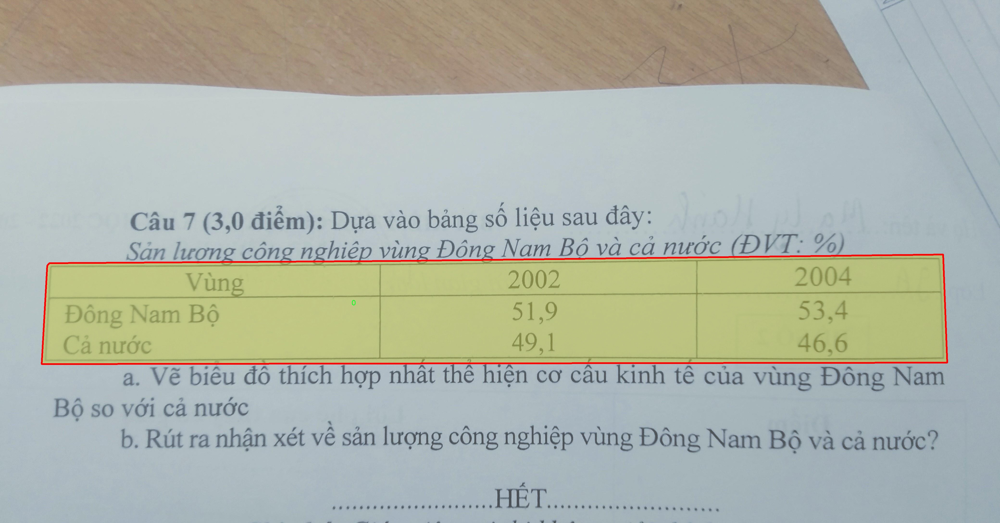

# 表格区域分割系统： yolov8-seg-FocalModulation

### 1.研究背景与意义

[参考博客](https://gitee.com/YOLOv8_YOLOv11_Segmentation_Studio/projects)

[博客来源](https://kdocs.cn/l/cszuIiCKVNis)

研究背景与意义

随着信息技术的迅猛发展，数据的呈现形式日益多样化，尤其是在文档和表格数据的处理上，传统的手工输入和处理方式已无法满足现代社会对高效性和准确性的需求。表格作为一种重要的信息组织形式，广泛应用于金融、医疗、科研等多个领域，其结构化的信息展示使得数据的提取和分析变得尤为重要。然而，现有的表格数据提取技术仍存在诸多挑战，尤其是在复杂背景下的表格区域分割任务中，传统方法往往难以实现高精度的分割，导致后续的数据提取和分析受到影响。

在此背景下，基于深度学习的目标检测和实例分割技术逐渐成为研究的热点。YOLO（You Only Look Once）系列模型因其优越的实时性和准确性，已被广泛应用于各类视觉任务中。YOLOv8作为该系列的最新版本，进一步提升了模型的性能，尤其在小目标检测和复杂场景下的表现上具有显著优势。然而，针对表格区域的分割任务，YOLOv8的标准模型仍需进行改进，以适应表格数据的特殊性和复杂性。

本研究旨在基于改进的YOLOv8模型，构建一个高效的表格区域分割系统。通过对模型架构的优化和训练策略的调整，我们希望能够提升表格区域的分割精度，尤其是在复杂背景和多样化表格样式下的表现。为此，我们使用了包含1200张图像的“tab-seg”数据集，该数据集专门针对表格区域的实例分割任务进行标注，涵盖了丰富的表格样式和布局，为模型的训练和评估提供了坚实的基础。

本研究的意义不仅在于技术层面的创新，更在于其广泛的应用前景。高效的表格区域分割系统将为各行业的数据处理提供有力支持，提升信息提取的自动化程度，减少人工干预，提高工作效率。同时，该系统的成功应用也将为后续的文档理解、信息检索等领域提供新的思路和方法，推动相关技术的发展。

综上所述，基于改进YOLOv8的表格区域分割系统的研究，既是对现有技术的深化与拓展，也是对实际应用需求的积极响应。通过本研究，我们期望能够为表格数据的智能处理提供一种有效的解决方案，推动相关领域的研究与应用向前发展。

### 2.图片演示


注意：本项目提供完整的训练源码数据集和训练教程,由于此博客编辑较早,暂不提供权重文件（best.pt）,需要按照6.训练教程进行训练后实现上图效果。

### 3.视频演示

[3.1 视频演示](https://www.bilibili.com/video/BV1zUmRY1EJs/)

### 4.数据集信息

##### 4.1 数据集类别数＆类别名

nc: 1
names: ['0']


##### 4.2 数据集信息简介

数据集信息展示

在本研究中，我们使用了名为“tab-seg”的数据集，以支持对YOLOv8-seg模型的训练和改进，旨在提升其在表格区域分割任务中的表现。该数据集专门设计用于处理表格图像，提供了丰富的样本和标注信息，以便于模型的学习和优化。数据集的类别数量为1，类别列表中仅包含一个类别“0”，这表明该数据集的重点是对表格区域的整体识别与分割，而非对不同类型的表格元素进行细分。这种设计简化了模型的训练过程，使其能够集中精力于表格的结构特征，从而提高分割的准确性和效率。

“tab-seg”数据集包含多种格式和风格的表格图像，涵盖了不同的布局、字体、颜色和背景。这种多样性确保了模型在训练过程中能够接触到广泛的表格样本，从而增强其泛化能力。每个图像都经过精心标注，确保模型在学习时能够准确识别出表格的边界和区域。这种高质量的标注对于深度学习模型的训练至关重要，因为它直接影响到模型的学习效果和最终的分割性能。

在数据集的构建过程中，研究团队采用了多种数据增强技术，以进一步丰富样本的多样性。这些技术包括旋转、缩放、裁剪和颜色变换等，旨在模拟现实世界中可能遇到的各种情况。通过这些增强，模型不仅能够学习到表格的基本特征，还能适应不同的视觉变化，从而提高其在实际应用中的鲁棒性。

此外，数据集的规模也经过精心设计，以确保训练过程的有效性和效率。数据集包含了数千张表格图像，足以支撑深度学习模型的训练需求。通过合理划分训练集、验证集和测试集，研究人员能够在训练过程中监控模型的性能，并进行必要的调整和优化。这种科学的划分方法有助于避免过拟合现象的发生，确保模型在未见数据上的表现同样出色。

在模型训练的过程中，使用“tab-seg”数据集所带来的优势不仅体现在分割精度的提升上，还在于其对表格结构的深刻理解。通过对单一类别的专注，YOLOv8-seg能够深入挖掘表格的内在特征，从而在复杂场景中实现更为精准的分割。这种针对性的训练策略，使得模型在面对多样化的表格形式时，依然能够保持高效的分割能力。

总之，“tab-seg”数据集为改进YOLOv8-seg的表格区域分割系统提供了坚实的基础。其丰富的样本、多样的表格形式以及高质量的标注，确保了模型在训练过程中的有效学习与优化。通过对该数据集的充分利用，我们期待在表格区域分割领域取得更为显著的进展，为相关应用提供更为精准和高效的解决方案。




### 5.项目依赖环境部署教程（零基础手把手教学）

[5.1 环境部署教程链接（零基础手把手教学）](https://www.bilibili.com/video/BV1jG4Ve4E9t/?vd_source=bc9aec86d164b67a7004b996143742dc)


[5.2 安装Python虚拟环境创建和依赖库安装视频教程链接（零基础手把手教学）](https://www.bilibili.com/video/BV1nA4VeYEze/?vd_source=bc9aec86d164b67a7004b996143742dc)

### 6.手把手YOLOV8-seg训练视频教程（零基础手把手教学）

[6.1 手把手YOLOV8-seg训练视频教程（零基础小白有手就能学会）](https://www.bilibili.com/video/BV1cA4VeYETe/?vd_source=bc9aec86d164b67a7004b996143742dc)


按照上面的训练视频教程链接加载项目提供的数据集，运行train.py即可开始训练



     Epoch   gpu_mem       box       obj       cls    labels  img_size
     1/200     0G   0.01576   0.01955  0.007536        22      1280: 100%|██████████| 849/849 [14:42<00:00,  1.04s/it]
               Class     Images     Labels          P          R     mAP@.5 mAP@.5:.95: 100%|██████████| 213/213 [01:14<00:00,  2.87it/s]
                 all       3395      17314      0.994      0.957      0.0957      0.0843

     Epoch   gpu_mem       box       obj       cls    labels  img_size
     2/200     0G   0.01578   0.01923  0.007006        22      1280: 100%|██████████| 849/849 [14:44<00:00,  1.04s/it]
               Class     Images     Labels          P          R     mAP@.5 mAP@.5:.95: 100%|██████████| 213/213 [01:12<00:00,  2.95it/s]
                 all       3395      17314      0.996      0.956      0.0957      0.0845

     Epoch   gpu_mem       box       obj       cls    labels  img_size
     3/200     0G   0.01561    0.0191  0.006895        27      1280: 100%|██████████| 849/849 [10:56<00:00,  1.29it/s]
               Class     Images     Labels          P          R     mAP@.5 mAP@.5:.95: 100%|███████   | 187/213 [00:52<00:00,  4.04it/s]
                 all       3395      17314      0.996      0.957      0.0957      0.0845


### 7.50+种全套YOLOV8-seg创新点加载调参实验视频教程（一键加载写好的改进模型的配置文件）

[7.1 50+种全套YOLOV8-seg创新点加载调参实验视频教程（一键加载写好的改进模型的配置文件）](https://www.bilibili.com/video/BV1Hw4VePEXv/?vd_source=bc9aec86d164b67a7004b996143742dc)

### YOLOV8-seg算法简介

原始YOLOv8-seg算法原理

YOLOv8-seg算法是目标检测领域中的最新进展，建立在YOLOv5和YOLOv7的基础上，旨在通过一系列创新和改进来提升目标检测的性能和效率。该算法的结构依然遵循YOLO系列的经典设计，包括输入层、主干网络、特征融合层（Neck）和解耦头（Head），但在每个模块中都融入了新的思想和技术，使得YOLOv8-seg在处理复杂场景时表现出色。

首先，YOLOv8的主干网络采用了CSPDarknet的思想，这一设计理念旨在通过深度学习网络的特征提取能力来实现更高的检测精度。在YOLOv8中，C3模块被C2f模块所替代，C2f模块引入了ELAN（Efficient Layer Aggregation Network）思想，通过增加多个shortcut连接来缓解深层网络中的梯度消失问题，从而提升了模型的训练效率和特征重用能力。C2f模块的设计包含了三个CBS（Convolution + Batch Normalization + SiLU）卷积模块和多个Bottleneck结构，这种结构的组合不仅保持了输入和输出特征图的尺寸一致性，还通过控制最短和最长的梯度路径，增强了模型对隐藏特征的提取能力。

在特征融合层（Neck）中，YOLOv8采用了PAN-FPN（Path Aggregation Network with Feature Pyramid Network）结构，旨在实现多尺度特征的深度融合。该结构的设计分为两个阶段：首先是自下而上的特征融合，通过上采样将高层特征与中层特征结合，接着将融合后的特征通过横向连接输出到解耦头。这一过程确保了不同层次的特征能够充分融合，从而提升了模型对目标的检测能力。

YOLOv8-seg在目标检测的过程中摒弃了传统的Anchor-Base思想，转而采用Anchor-Free的设计理念。这一转变使得模型在处理不同尺寸和形状的目标时，能够更加灵活和高效。YOLOv8-seg的解耦头部分采用了二阶段FCOS（Fully Convolutional One-Stage）目标检测网络结构，分类和回归分支被有效解耦，极大地提高了模型的检测精度和速度。

在损失函数的设计上，YOLOv8-seg使用了VFLLoss（Variational Focal Loss）作为分类损失，DFLLoss和CIoULoss作为回归损失。这种多损失函数的组合不仅能够有效解决样本不平衡问题，还能提高模型对难以识别样本的关注度，进而提升整体检测性能。此外，YOLOv8-seg还引入了Task-Aligned的样本匹配策略，使得模型在训练过程中能够更好地适应不同任务的需求。

在数据预处理方面，YOLOv8-seg采用了YOLOv5的策略，包括马赛克增强、混合增强、空间扰动和颜色扰动等多种增强手段，以提升模型的泛化能力。输入图像在经过640x640的缩放后，经过主干网络的特征提取，最终通过特征融合层和解耦头生成检测结果。值得注意的是，YOLOv8-seg在处理复杂场景时，能够有效利用不同尺度的特征图，确保每一层的特征图都具备适当的分辨率和高层语义信息，从而提升对目标的检测精度。

综上所述，YOLOv8-seg算法通过对主干网络、特征融合层和解耦头的设计进行一系列创新，成功地提升了目标检测的性能和效率。其在处理复杂场景和小目标时表现出的优越性，使得YOLOv8-seg成为当前目标检测领域中的一项重要技术进展。随着YOLOv8-seg的不断发展和完善，未来在实际应用中，预计将会在智能监控、自动驾驶、无人机视觉等多个领域发挥重要作用。


### 9.系统功能展示（检测对象为举例，实际内容以本项目数据集为准）

图9.1.系统支持检测结果表格显示

  图9.2.系统支持置信度和IOU阈值手动调节

  图9.3.系统支持自定义加载权重文件best.pt(需要你通过步骤5中训练获得)

  图9.4.系统支持摄像头实时识别

  图9.5.系统支持图片识别

  图9.6.系统支持视频识别

  图9.7.系统支持识别结果文件自动保存

  图9.8.系统支持Excel导出检测结果数据


### 10.50+种全套YOLOV8-seg创新点原理讲解（非科班也可以轻松写刊发刊，V11版本正在科研待更新）

#### 10.1 由于篇幅限制，每个创新点的具体原理讲解就不一一展开，具体见下列网址中的创新点对应子项目的技术原理博客网址【Blog】：


[10.1 50+种全套YOLOV8-seg创新点原理讲解链接](https://gitee.com/qunmasj/good)

#### 10.2 部分改进模块原理讲解(完整的改进原理见上图和技术博客链接)【如果此小节的图加载失败可以通过CSDN或者Github搜索该博客的标题访问原始博客，原始博客图片显示正常】
### YOLOv8简介
#### Neck模块设计
骨干网络和 Neck 的具体变化为：

第一个卷积层的 kernel 从 6x6 变成了 3x3
所有的 C3 模块换成 C2f，结构如下所示，可以发现多了更多的跳层连接和额外的 Split 操作


去掉了 Neck 模块中的 2 个卷积连接层
Backbone 中 C2f 的 block 数从 3-6-9-3 改成了 3-6-6-3
查看 N/S/M/L/X 等不同大小模型，可以发现 N/S 和 L/X 两组模型只是改了缩放系数，但是 S/M/L 等骨干网络的通道数设置不一样，没有遵循同一套缩放系数。如此设计的原因应该是同一套缩放系数下的通道设置不是最优设计，YOLOv7 网络设计时也没有遵循一套缩放系数作用于所有模型。

#### Head模块设计
Head 部分变化最大，从原先的耦合头变成了解耦头，并且从 YOLOv5 的 Anchor-Based 变成了 Anchor-Free。其结构如下所示：


可以看出，不再有之前的 objectness 分支，只有解耦的分类和回归分支，并且其回归分支使用了 Distribution Focal Loss 中提出的积分形式表示法。

#### Loss 计算
Loss 计算过程包括 2 个部分： 正负样本分配策略和 Loss 计算。 现代目标检测器大部分都会在正负样本分配策略上面做文章，典型的如 YOLOX 的 simOTA、TOOD 的 TaskAlignedAssigner 和 RTMDet 的 DynamicSoftLabelAssigner，这类 Assigner 大都是动态分配策略，而 YOLOv5 采用的依然是静态分配策略。考虑到动态分配策略的优异性，YOLOv8 算法中则直接引用了 TOOD 的 TaskAlignedAssigner。 TaskAlignedAssigner 的匹配策略简单总结为： 根据分类与回归的分数加权的分数选择正样本。

s 是标注类别对应的预测分值，u 是预测框和 gt 框的 iou，两者相乘就可以衡量对齐程度。

对于每一个 GT，对所有的预测框基于 GT 类别对应分类分数，预测框与 GT 的 IoU 的加权得到一个关联分类以及回归的对齐分数 alignment_metrics 。
对于每一个 GT，直接基于 alignment_metrics 对齐分数选取 topK 大的作为正样本
Loss 计算包括 2 个分支： 分类和回归分支，没有了之前的 objectness 分支。
分类分支依然采用 BCE Loss
回归分支需要和 Distribution Focal Loss 中提出的积分形式表示法绑定，因此使用了 Distribution Focal Loss， 同时还使用了 CIoU Loss
Loss 采用一定权重比例加权即可。
#### 训练数据增强
数据增强方面和 YOLOv5 差距不大，只不过引入了 YOLOX 中提出的最后 10 个 epoch 关闭 Mosaic 的操作。假设训练 epoch 是 500，其示意图如下所示：

### RCS-OSA的基本原理
参考该博客，RCSOSA（RCS-One-Shot Aggregation）是RCS-YOLO中提出的一种结构，我们可以将主要原理概括如下：

1. RCS（Reparameterized Convolution based on channel Shuffle）: 结合了通道混洗，通过重参数化卷积来增强网络的特征提取能力。

2. RCS模块: 在训练阶段，利用多分支结构学习丰富的特征表示；在推理阶段，通过结构化重参数化简化为单一分支，减少内存消耗。

3. OSA（One-Shot Aggregation）: 一次性聚合多个特征级联，减少网络计算负担，提高计算效率。

4. 特征级联: RCS-OSA模块通过堆叠RCS，确保特征的复用并加强不同层之间的信息流动。

#### RCS
RCS（基于通道Shuffle的重参数化卷积）是RCS-YOLO的核心组成部分，旨在训练阶段通过多分支结构学习丰富的特征信息，并在推理阶段通过简化为单分支结构来减少内存消耗，实现快速推理。此外，RCS利用通道分割和通道Shuffle操作来降低计算复杂性，同时保持通道间的信息交换，这样在推理阶段相比普通的3×3卷积可以减少一半的计算复杂度。通过结构重参数化，RCS能够在训练阶段从输入特征中学习深层表示，并在推理阶段实现快速推理，同时减少内存消耗。

#### RCS模块
RCS（基于通道Shuffle的重参数化卷积）模块中，结构在训练阶段使用多个分支，包括1x1和3x3的卷积，以及一个直接的连接（Identity），用于学习丰富的特征表示。在推理阶段，结构被重参数化成一个单一的3x3卷积，以减少计算复杂性和内存消耗，同时保持训练阶段学到的特征表达能力。这与RCS的设计理念紧密相连，即在不牺牲性能的情况下提高计算效率。


上图为大家展示了RCS的结构，分为训练阶段（a部分）和推理阶段（b部分）。在训练阶段，输入通过通道分割，一部分输入经过RepVGG块，另一部分保持不变。然后通过1x1卷积和3x3卷积处理RepVGG块的输出，与另一部分输入进行通道Shuffle和连接。在推理阶段，原来的多分支结构被简化为一个单一的3x3 RepConv块。这种设计允许在训练时学习复杂特征，在推理时减少计算复杂度。黑色边框的矩形代表特定的模块操作，渐变色的矩形代表张量的特定特征，矩形的宽度代表张量的通道数。 

#### OSA
OSA（One-Shot Aggregation）是一个关键的模块，旨在提高网络在处理密集连接时的效率。OSA模块通过表示具有多个感受野的多样化特征，并在最后的特征映射中仅聚合一次所有特征，从而克服了DenseNet中密集连接的低效率问题。

OSA模块的使用有两个主要目的：

1. 提高特征表示的多样性：OSA通过聚合具有不同感受野的特征来增加网络对于不同尺度的敏感性，这有助于提升模型对不同大小目标的检测能力。

2. 提高效率：通过在网络的最后一部分只进行一次特征聚合，OSA减少了重复的特征计算和存储需求，从而提高了网络的计算和能源效率。

在RCS-YOLO中，OSA模块被进一步与RCS（基于通道Shuffle的重参数化卷积）相结合，形成RCS-OSA模块。这种结合不仅保持了低成本的内存消耗，而且还实现了语义信息的有效提取，对于构建轻量级和大规模的对象检测器尤为重要。

下面我将为大家展示RCS-OSA（One-Shot Aggregation of RCS）的结构。


在RCS-OSA模块中，输入被分为两部分，一部分直接通过，另一部分通过堆叠的RCS模块进行处理。处理后的特征和直接通过的特征在通道混洗（Channel Shuffle）后合并。这种结构设计用于增强模型的特征提取和利用效率，是RCS-YOLO架构中的一个关键组成部分旨在通过一次性聚合来提高模型处理特征的能力，同时保持计算效率。

#### 特征级联
特征级联（feature cascade）是一种技术，通过在网络的一次性聚合（one-shot aggregate）路径上维持有限数量的特征级联来实现的。在RCS-YOLO中，特别是在RCS-OSA（RCS-Based One-Shot Aggregation）模块中，只保留了三个特征级联。

特征级联的目的是为了减轻网络计算负担并降低内存占用。这种方法可以有效地聚合不同层次的特征，提高模型的语义信息提取能力，同时避免了过度复杂化网络结构所带来的低效率和高资源消耗。

下面为大家提供的图像展示的是RCS-YOLO的整体架构，其中包括RCS-OSA模块。RCS-OSA在模型中用于堆叠RCS模块，以确保特征的复用并加强不同层之间的信息流动。图中显示的多层RCS-OSA模块的排列和组合反映了它们如何一起工作以优化特征传递和提高检测性能。


总结：RCS-YOLO主要由RCS-OSA（蓝色模块）和RepVGG（橙色模块）构成。这里的n代表堆叠RCS模块的数量。n_cls代表检测到的对象中的类别数量。图中的IDetect是从YOLOv7中借鉴过来的，表示使用二维卷积神经网络的检测层。这个架构通过堆叠的RCS模块和RepVGG模块，以及两种类型的检测层，实现了对象检测的任务。 


### 11.项目核心源码讲解（再也不用担心看不懂代码逻辑）

#### 11.1 ultralytics\models\fastsam\val.py

以下是经过精简和注释的核心代码部分：

```python
# 导入必要的模块
from ultralytics.models.yolo.segment import SegmentationValidator
from ultralytics.utils.metrics import SegmentMetrics

class FastSAMValidator(SegmentationValidator):
    """
    自定义验证类，用于快速SAM（Segment Anything Model）分割，
    继承自SegmentationValidator类，专门定制快速SAM的验证过程。
    """

    def __init__(self, dataloader=None, save_dir=None, pbar=None, args=None, _callbacks=None):
        """
        初始化FastSAMValidator类，设置任务为'segment'并使用SegmentMetrics进行评估。

        参数:
            dataloader (torch.utils.data.DataLoader): 用于验证的数据加载器。
            save_dir (Path, optional): 保存结果的目录。
            pbar (tqdm.tqdm): 显示进度的进度条。
            args (SimpleNamespace): 验证器的配置。
            _callbacks (dict): 存储各种回调函数的字典。

        注意:
            本类禁用了ConfusionMatrix和其他相关指标的绘图，以避免错误。
        """
        # 调用父类构造函数进行初始化
        super().__init__(dataloader, save_dir, pbar, args, _callbacks)
        
        # 设置任务类型为分割
        self.args.task = 'segment'
        
        # 禁用绘图功能以避免错误
        self.args.plots = False  
        
        # 初始化评估指标
        self.metrics = SegmentMetrics(save_dir=self.save_dir, on_plot=self.on_plot)
```

### 代码分析与注释说明：

1. **导入模块**：
   - 从`ultralytics`库中导入`SegmentationValidator`和`SegmentMetrics`，这两个模块是进行分割验证和计算评估指标的核心组件。

2. **类定义**：
   - `FastSAMValidator`类继承自`SegmentationValidator`，用于快速SAM模型的分割验证。

3. **构造函数**：
   - `__init__`方法用于初始化验证器的各项参数，包括数据加载器、保存目录、进度条、配置参数和回调函数。
   - 使用`super().__init__()`调用父类的构造函数，以确保父类的初始化逻辑得以执行。

4. **任务设置**：
   - 将任务类型设置为`'segment'`，表明该验证器的主要功能是进行图像分割。

5. **禁用绘图**：
   - 将`self.args.plots`设置为`False`，禁用绘图功能，以避免在验证过程中出现错误。

6. **初始化评估指标**：
   - 创建`SegmentMetrics`实例，用于计算分割性能指标，并指定结果保存目录和绘图选项。

以上是对核心代码的分析和详细注释，帮助理解其功能和实现方式。

这个文件定义了一个名为 `FastSAMValidator` 的类，它是一个用于快速SAM（Segment Anything Model）分割的自定义验证类，继承自 `SegmentationValidator`。该类专门针对Ultralytics YOLO框架中的快速SAM进行验证过程的定制。

在类的文档字符串中，说明了该类的功能和属性。`FastSAMValidator` 主要用于设置任务为“分割”，并使用 `SegmentMetrics` 进行评估。此外，为了避免在验证过程中出现错误，该类禁用了绘图功能。

构造函数 `__init__` 初始化了 `FastSAMValidator` 类，接收多个参数，包括数据加载器、结果保存目录、进度条、配置参数和回调函数字典。构造函数首先调用父类的初始化方法，然后将任务类型设置为“segment”，并将绘图功能禁用，以避免在验证过程中出现与混淆矩阵等相关的错误。最后，它还初始化了 `SegmentMetrics`，用于评估分割性能。

总体来说，这个文件的主要目的是为快速SAM分割提供一个专门的验证工具，确保在验证过程中能够高效且准确地评估模型的性能，同时避免因绘图功能引发的潜在问题。

#### 11.2 ultralytics\hub\auth.py

以下是经过简化和注释的核心代码部分：

```python
import requests  # 导入请求库，用于发送HTTP请求

# 定义API的根URL
HUB_API_ROOT = 'https://api.example.com'  # 示例API根URL
HUB_WEB_ROOT = 'https://web.example.com'  # 示例Web根URL
API_KEY_URL = f'{HUB_WEB_ROOT}/settings?tab=api+keys'  # API密钥设置页面的URL

class Auth:
    """
    处理身份验证过程，包括API密钥管理、基于cookie的身份验证和头部生成。
    """
    id_token = api_key = model_key = False  # 初始化身份验证相关的属性

    def __init__(self, api_key='', verbose=False):
        """
        初始化Auth类，可以传入API密钥。
        """
        # 处理输入的API密钥，保留API密钥部分
        api_key = api_key.split('_')[0]
        self.api_key = api_key or ''  # 如果没有提供API密钥，则为空

        # 如果提供了API密钥
        if self.api_key:
            # 尝试进行身份验证
            success = self.authenticate()
        else:
            # 如果没有提供API密钥，尝试请求API密钥
            success = self.request_api_key()

        # 如果身份验证成功，更新设置
        if success:
            print('身份验证成功')  # 打印成功信息
        else:
            print('身份验证失败')  # 打印失败信息

    def request_api_key(self, max_attempts=3):
        """
        提示用户输入API密钥。
        """
        import getpass  # 导入获取密码的库
        for attempts in range(max_attempts):
            input_key = getpass.getpass('请输入API密钥: ')  # 隐藏输入
            self.api_key = input_key.split('_')[0]  # 去掉模型ID
            if self.authenticate():  # 尝试身份验证
                return True
        raise ConnectionError('身份验证失败')  # 超过最大尝试次数，抛出异常

    def authenticate(self) -> bool:
        """
        尝试使用API密钥进行身份验证。
        """
        try:
            header = self.get_auth_header()  # 获取身份验证头
            if header:
                r = requests.post(f'{HUB_API_ROOT}/v1/auth', headers=header)  # 发送身份验证请求
                return r.json().get('success', False)  # 返回请求结果
            return False
        except Exception:
            return False  # 发生异常，返回失败

    def get_auth_header(self):
        """
        获取用于API请求的身份验证头。
        """
        if self.api_key:
            return {'x-api-key': self.api_key}  # 返回API密钥头
        return None  # 如果没有API密钥，返回None
```

### 代码说明：
1. **导入库**：使用`requests`库发送HTTP请求。
2. **API URL**：定义了API和Web的根URL。
3. **Auth类**：负责处理身份验证，包括初始化、请求API密钥和进行身份验证。
4. **初始化方法**：可以接收API密钥并尝试进行身份验证。如果没有提供密钥，则请求用户输入。
5. **请求API密钥**：通过`getpass`库安全地获取用户输入的API密钥，并尝试进行身份验证。
6. **身份验证方法**：使用API密钥向服务器发送身份验证请求，并返回请求结果。
7. **获取身份验证头**：根据是否有API密钥返回相应的请求头。

以上是对代码的简化和详细注释，核心逻辑保持不变。

这个程序文件是一个用于管理身份验证的类，名为 `Auth`，主要用于处理与 Ultralytics Hub 的 API 交互中的身份验证过程。它支持多种身份验证方式，包括直接使用 API 密钥、通过浏览器 cookies 进行身份验证（特别是在 Google Colab 环境中），以及提示用户输入 API 密钥。

在类的初始化方法中，可以选择性地传入一个 API 密钥。如果提供了 API 密钥，程序会检查这个密钥是否与设置中的密钥匹配。如果匹配，程序会记录用户已经登录的信息；如果不匹配，则会尝试进行身份验证。如果没有提供 API 密钥且当前环境是 Google Colab，程序会尝试通过 cookies 进行身份验证；如果都不满足，则会请求用户输入 API 密钥。

`request_api_key` 方法用于提示用户输入 API 密钥，最多允许三次尝试。如果成功验证，程序会更新设置中的 API 密钥，并记录新的登录信息；如果失败，则抛出连接错误。

`authenticate` 方法尝试使用提供的 API 密钥或 ID 令牌与服务器进行身份验证。如果成功，返回 True；否则，返回 False，并记录警告信息。

`auth_with_cookies` 方法专门用于在 Google Colab 环境中通过 cookies 进行身份验证。如果成功获取到身份验证信息，则会设置 ID 令牌并尝试进行身份验证。

`get_auth_header` 方法用于生成 API 请求所需的身份验证头。如果设置了 ID 令牌，则返回包含 Bearer 令牌的头信息；如果设置了 API 密钥，则返回包含 API 密钥的头信息；如果两者都没有，则返回 None。

整体而言，这个文件的主要功能是确保用户能够顺利地进行身份验证，以便安全地访问 Ultralytics Hub 的服务。

#### 11.3 ultralytics\nn\tasks.py

以下是代码中最核心的部分，并附上详细的中文注释：

```python
import torch
import torch.nn as nn

class BaseModel(nn.Module):
    """BaseModel类是Ultralytics YOLO系列模型的基类。"""

    def forward(self, x, *args, **kwargs):
        """
        模型的前向传播方法，处理单个尺度的输入。

        参数:
            x (torch.Tensor | dict): 输入图像张量或包含图像张量和真实标签的字典。

        返回:
            (torch.Tensor): 网络的输出。
        """
        if isinstance(x, dict):  # 如果输入是字典，表示训练或验证时的情况
            return self.loss(x, *args, **kwargs)  # 计算损失
        return self.predict(x, *args, **kwargs)  # 进行预测

    def predict(self, x, profile=False, visualize=False, augment=False):
        """
        通过网络进行前向传播。

        参数:
            x (torch.Tensor): 输入张量。
            profile (bool): 如果为True，打印每层的计算时间，默认为False。
            visualize (bool): 如果为True，保存模型的特征图，默认为False。
            augment (bool): 在预测时进行图像增强，默认为False。

        返回:
            (torch.Tensor): 模型的最后输出。
        """
        if augment:
            return self._predict_augment(x)  # 进行增强预测
        return self._predict_once(x, profile, visualize)  # 进行一次预测

    def _predict_once(self, x, profile=False, visualize=False):
        """
        执行一次前向传播。

        参数:
            x (torch.Tensor): 输入张量。
            profile (bool): 如果为True，打印每层的计算时间，默认为False。
            visualize (bool): 如果为True，保存模型的特征图，默认为False。

        返回:
            (torch.Tensor): 模型的最后输出。
        """
        y, dt = [], []  # 输出列表和时间列表
        for m in self.model:  # 遍历模型中的每一层
            if m.f != -1:  # 如果不是来自前一层
                x = y[m.f] if isinstance(m.f, int) else [x if j == -1 else y[j] for j in m.f]  # 从早期层获取输入
            if profile:
                self._profile_one_layer(m, x, dt)  # 记录当前层的计算时间
            x = m(x)  # 运行当前层
            y.append(x if m.i in self.save else None)  # 保存输出
            if visualize:
                feature_visualization(x, m.type, m.i, save_dir=visualize)  # 可视化特征图
        return x  # 返回最后的输出

    def loss(self, batch, preds=None):
        """
        计算损失。

        参数:
            batch (dict): 用于计算损失的批次数据。
            preds (torch.Tensor | List[torch.Tensor]): 预测结果。

        返回:
            (torch.Tensor): 计算得到的损失值。
        """
        if not hasattr(self, 'criterion'):
            self.criterion = self.init_criterion()  # 初始化损失函数

        preds = self.forward(batch['img']) if preds is None else preds  # 获取预测结果
        return self.criterion(preds, batch)  # 计算损失

    def init_criterion(self):
        """初始化BaseModel的损失标准。"""
        raise NotImplementedError('compute_loss() needs to be implemented by task heads')


class DetectionModel(BaseModel):
    """YOLOv8检测模型。"""

    def __init__(self, cfg='yolov8n.yaml', ch=3, nc=None, verbose=True):
        """初始化YOLOv8检测模型，使用给定的配置和参数。"""
        super().__init__()
        self.yaml = cfg if isinstance(cfg, dict) else yaml_model_load(cfg)  # 加载配置字典

        # 定义模型
        ch = self.yaml['ch'] = self.yaml.get('ch', ch)  # 输入通道
        if nc and nc != self.yaml['nc']:
            self.yaml['nc'] = nc  # 覆盖YAML中的类别数
        self.model, self.save = parse_model(deepcopy(self.yaml), ch=ch, verbose=verbose)  # 解析模型
        self.names = {i: f'{i}' for i in range(self.yaml['nc'])}  # 默认名称字典

        # 初始化权重和偏置
        initialize_weights(self)

    def init_criterion(self):
        """初始化DetectionModel的损失标准。"""
        return v8DetectionLoss(self)  # 返回YOLOv8检测损失


# 其他模型类（SegmentationModel, PoseModel, ClassificationModel等）可以在此基础上进行扩展
```

以上代码片段包含了YOLO模型的基本结构和核心功能，提供了前向传播、损失计算等基本操作，并定义了一个用于检测的模型类。

这个程序文件是Ultralytics YOLO（You Only Look Once）系列模型的一个核心模块，主要用于定义和实现不同类型的深度学习模型，包括目标检测、图像分割、姿态估计和分类等。文件中包含了多个类和函数，下面对其主要内容进行逐一说明。

首先，文件导入了一些必要的库和模块，包括PyTorch、Ultralytics的自定义模块和一些实用工具。接着，定义了一个基础模型类`BaseModel`，它继承自`nn.Module`，是所有YOLO模型的基类。这个类实现了模型的前向传播、预测、损失计算等基本功能。它包含了多个方法，如`forward`、`predict`、`loss`等，分别用于执行前向计算、进行预测和计算损失。

在`BaseModel`中，`predict`方法负责处理输入数据并返回模型的输出。该方法支持多种选项，如是否进行图像增强、是否可视化特征图等。`loss`方法则用于计算模型的损失，通常在训练过程中调用。

接下来，文件中定义了多个特定模型类，如`DetectionModel`、`SegmentationModel`、`PoseModel`和`ClassificationModel`，这些类分别实现了目标检测、图像分割、姿态估计和分类的具体功能。每个模型类都继承自`BaseModel`，并在其构造函数中初始化模型的配置、输入通道数和类别数等参数。

例如，`DetectionModel`类用于实现YOLOv8的目标检测功能。它在初始化时加载模型配置，并构建模型结构。该类还实现了特定于检测任务的损失计算方法`init_criterion`，使用YOLOv8的检测损失函数。

`SegmentationModel`和`PoseModel`类与`DetectionModel`类似，分别用于实现图像分割和姿态估计的功能，且各自定义了相应的损失计算方法。

此外，`ClassificationModel`类用于实现图像分类功能。它的构造函数从YAML配置文件中加载模型配置，并根据输入通道和类别数初始化模型。

文件中还定义了一个`RTDETRDetectionModel`类，用于实现实时检测和跟踪功能，扩展了检测模型的功能，支持更复杂的任务。

最后，文件中包含了一些辅助函数，如`torch_safe_load`用于安全加载模型权重，`attempt_load_weights`和`attempt_load_one_weight`用于加载模型权重并处理模型兼容性，`parse_model`用于解析YOLO模型的YAML配置并构建相应的PyTorch模型。

总的来说，这个文件实现了YOLO系列模型的核心功能，提供了模型的定义、训练和推理的基本框架，并支持多种深度学习任务的实现。

#### 11.4 ultralytics\utils\ops.py

以下是经过简化并注释的核心代码部分，主要集中在与边界框处理和非极大值抑制（NMS）相关的功能上：

```python
import torch
import torchvision

def non_max_suppression(prediction, conf_thres=0.25, iou_thres=0.45, classes=None, max_det=300):
    """
    对一组边界框执行非极大值抑制（NMS），以去除冗余的重叠框。

    Args:
        prediction (torch.Tensor): 预测的边界框，形状为 (batch_size, num_classes + 4, num_boxes)。
        conf_thres (float): 置信度阈值，低于该值的框将被过滤。
        iou_thres (float): IoU阈值，低于该值的框将被过滤。
        classes (List[int]): 要考虑的类索引列表。如果为None，则考虑所有类。
        max_det (int): NMS后保留的最大框数。

    Returns:
        List[torch.Tensor]: 每个图像的保留框的列表，形状为 (num_boxes, 6)，包含 (x1, y1, x2, y2, confidence, class)。
    """
    # 检查置信度和IoU阈值的有效性
    assert 0 <= conf_thres <= 1, f'Invalid Confidence threshold {conf_thres}'
    assert 0 <= iou_thres <= 1, f'Invalid IoU {iou_thres}'

    device = prediction.device  # 获取设备信息
    bs = prediction.shape[0]  # 批量大小
    nc = prediction.shape[1] - 4  # 类别数量
    nm = prediction.shape[1] - nc - 4  # 掩码数量
    xc = prediction[:, 4:4 + nc].amax(1) > conf_thres  # 根据置信度筛选候选框

    output = [torch.zeros((0, 6 + nm), device=prediction.device)] * bs  # 初始化输出

    for xi, x in enumerate(prediction):  # 遍历每个图像的预测结果
        x = x[xc[xi]]  # 根据置信度筛选框

        if not x.shape[0]:  # 如果没有框，跳过
            continue

        # 分离边界框、置信度和类别
        box, cls, mask = x.split((4, nc, nm), 1)

        # 仅保留最高置信度的类别
        conf, j = cls.max(1, keepdim=True)
        x = torch.cat((box, conf, j.float(), mask), 1)[conf.view(-1) > conf_thres]

        # 根据类别筛选框
        if classes is not None:
            x = x[(x[:, 5:6] == torch.tensor(classes, device=x.device)).any(1)]

        n = x.shape[0]  # 当前图像的框数量
        if not n:  # 如果没有框，跳过
            continue
        if n > max_det:  # 如果框数量超过最大限制，按置信度排序并截断
            x = x[x[:, 4].argsort(descending=True)[:max_det]]

        # 执行NMS
        boxes, scores = x[:, :4], x[:, 4]  # 提取边界框和置信度
        i = torchvision.ops.nms(boxes, scores, iou_thres)  # 进行NMS
        output[xi] = x[i]  # 保存结果

    return output  # 返回每个图像的NMS结果
```

### 代码说明：
1. **非极大值抑制（NMS）**：该函数用于从多个重叠的边界框中筛选出最有可能的框，避免重复检测同一目标。
2. **参数说明**：
   - `prediction`：包含预测边界框的张量，格式为 `(batch_size, num_classes + 4, num_boxes)`。
   - `conf_thres`：置信度阈值，低于该值的框将被过滤。
   - `iou_thres`：IoU阈值，用于决定框之间的重叠程度。
   - `classes`：可选参数，指定要考虑的类别。
   - `max_det`：NMS后保留的最大框数。
3. **输出**：返回每个图像的保留框的列表，包含框的坐标、置信度和类别信息。

这个程序文件是一个用于处理YOLO（You Only Look Once）目标检测模型的工具库，主要包括一些操作和辅助函数，帮助在图像处理和目标检测中进行各种计算和转换。

首先，文件中定义了一个`Profile`类，用于性能分析。这个类可以作为装饰器或上下文管理器使用，能够记录代码块的执行时间，方便开发者评估代码的性能。

接下来，文件中定义了一些函数，用于处理目标检测中的边界框和分割掩码。例如，`segment2box`函数将分割标签转换为边界框标签，并确保边界框在图像内部。`scale_boxes`函数则用于根据图像的不同尺寸重新缩放边界框，确保它们在新图像中保持正确的位置和大小。

`non_max_suppression`函数是目标检测中常用的非极大值抑制算法，用于过滤重叠的边界框，只保留置信度最高的框。该函数支持多标签和掩码，并允许用户设置置信度阈值和IoU（Intersection over Union）阈值，以优化检测结果。

此外，文件中还包含了一些坐标转换函数，例如`xyxy2xywh`和`xywh2xyxy`，用于在不同的边界框表示法之间进行转换。这些函数对于处理YOLO模型的输出非常重要，因为YOLO使用的是特定的边界框格式。

文件还实现了一些与掩码处理相关的函数，例如`process_mask`和`crop_mask`，这些函数用于将掩码应用于边界框，并对掩码进行上采样，以提高掩码的质量。

最后，文件中还包含了一些辅助函数，如`clean_str`，用于清理字符串中的特殊字符，以及`convert_torch2numpy_batch`，用于将PyTorch张量转换为NumPy数组，以便于后续处理。

总的来说，这个文件提供了一系列功能强大的工具，帮助开发者在使用YOLO模型进行目标检测时进行图像处理、边界框和掩码的管理与转换。

#### 11.5 utils.py

以下是经过简化和注释的核心代码部分：

```python
import os
import cv2
import pandas as pd
import streamlit as st
from PIL import Image
from QtFusion.path import abs_path

def save_uploaded_file(uploaded_file):
    """
    保存上传的文件到服务器上。

    Args:
        uploaded_file (UploadedFile): 通过Streamlit上传的文件。

    Returns:
        str: 保存文件的完整路径，如果没有文件上传则返回 None。
    """
    # 检查是否有文件上传
    if uploaded_file is not None:
        base_path = "tempDir"  # 定义文件保存的基本路径

        # 如果路径不存在，创建这个路径
        if not os.path.exists(base_path):
            os.makedirs(base_path)
        
        # 获取文件的完整路径
        file_path = os.path.join(base_path, uploaded_file.name)

        # 以二进制写模式打开文件并写入
        with open(file_path, "wb") as f:
            f.write(uploaded_file.getbuffer())  # 将上传的文件内容写入到指定路径

        return file_path  # 返回文件路径

    return None  # 如果没有文件上传，返回 None


def concat_results(result, location, confidence, time):
    """
    显示检测结果。

    Args:
        result (str): 检测结果。
        location (str): 检测位置。
        confidence (str): 置信度。
        time (str): 检测用时。

    Returns:
        DataFrame: 包含检测结果的 DataFrame。
    """
    # 创建一个包含这些信息的 DataFrame
    result_data = {
        "识别结果": [result],
        "位置": [location],
        "置信度": [confidence],
        "用时": [time]
    }

    results_df = pd.DataFrame(result_data)  # 将结果数据转换为 DataFrame
    return results_df  # 返回结果 DataFrame


def get_camera_names():
    """
    获取可用摄像头名称列表。

    Returns:
        list: 返回包含“未启用摄像头”和可用摄像头索引号的列表。
    """
    camera_names = ["摄像头检测关闭", "0"]  # 初始化摄像头名称列表
    max_test_cameras = 10  # 定义要测试的最大摄像头数量

    # 测试可用摄像头
    for i in range(max_test_cameras):
        cap = cv2.VideoCapture(i, cv2.CAP_DSHOW)  # 尝试打开摄像头
        if cap.isOpened() and str(i) not in camera_names:  # 如果摄像头打开成功且未在列表中
            camera_names.append(str(i))  # 添加摄像头索引到列表
            cap.release()  # 释放摄像头资源

    if len(camera_names) == 1:  # 如果没有找到可用摄像头
        st.write("未找到可用的摄像头")  # 提示用户
    return camera_names  # 返回摄像头名称列表
```

### 代码说明：
1. **`save_uploaded_file` 函数**：负责保存用户上传的文件到服务器的指定目录，并返回文件的完整路径。
2. **`concat_results` 函数**：将检测结果、位置、置信度和用时等信息整合到一个 Pandas DataFrame 中，便于后续处理和展示。
3. **`get_camera_names` 函数**：检测系统中可用的摄像头，并返回一个包含摄像头名称的列表，方便用户选择。

这个程序文件 `utils.py` 主要包含了一些用于处理文件上传、显示检测结果、加载默认图片以及获取可用摄像头名称的实用函数。

首先，文件导入了一些必要的库，包括 `os`、`cv2`、`pandas`、`streamlit`、`PIL` 和 `QtFusion.path`。这些库分别用于文件操作、计算机视觉、数据处理、Web 应用开发、图像处理和路径管理。

`save_uploaded_file` 函数用于保存用户通过 Streamlit 上传的文件。它首先检查是否有文件上传，如果有，则定义一个基本路径 `tempDir` 来保存文件。如果该路径不存在，函数会创建它。接着，函数获取上传文件的完整路径，并以二进制写模式打开文件，将上传的内容写入到指定路径中。最后，函数返回保存文件的完整路径，如果没有文件上传，则返回 `None`。

`concat_results` 函数用于显示检测结果。它接收检测结果、位置、置信度和检测用时作为参数，并将这些信息存储在一个 Pandas DataFrame 中。该函数返回一个包含这些信息的 DataFrame，方便后续的数据处理和展示。

`load_default_image` 函数用于加载一个默认的图片。它通过 `abs_path` 函数获取默认图片的路径，并使用 `Image.open` 方法打开该图片，最后返回图片对象。

`get_camera_names` 函数用于获取可用摄像头的名称列表。它初始化一个包含“摄像头检测关闭”和索引“0”的列表，并定义一个最大测试摄像头数量的上限。通过循环测试每个摄像头，如果能够成功打开摄像头，则将其索引添加到列表中。最后，如果没有找到可用的摄像头，函数会通过 Streamlit 显示一条信息，并返回摄像头名称列表。

整体来看，这个文件提供了一些基础的功能，便于在使用 Streamlit 开发应用时处理文件上传、展示结果、加载图片和获取摄像头信息。

### 12.系统整体结构（节选）

### 程序整体功能和构架概括

该程序是一个基于Ultralytics YOLO框架的目标检测和分割系统，主要用于实现快速SAM（Segment Anything Model）分割、身份验证、模型定义与训练、图像处理以及用户交互等功能。程序通过多个模块化的文件实现不同的功能，便于维护和扩展。

- **模型验证**：`val.py` 文件实现了快速SAM模型的验证功能，确保模型在分割任务中的性能。
- **身份验证**：`auth.py` 文件处理与Ultralytics Hub的身份验证，支持多种验证方式，确保用户安全访问服务。
- **模型定义与训练**：`tasks.py` 文件定义了不同类型的深度学习模型，包括目标检测、图像分割、姿态估计和分类等，提供了模型的基本框架和功能。
- **图像处理与操作**：`ops.py` 文件提供了一系列图像处理工具和操作函数，包括边界框处理、非极大值抑制、坐标转换等，支持目标检测任务。
- **用户交互与实用功能**：`utils.py` 文件实现了文件上传、结果展示、默认图片加载和摄像头信息获取等实用功能，增强了用户体验。

### 文件功能整理表

| 文件路径                                      | 功能描述                                                   |
|-----------------------------------------------|----------------------------------------------------------|
| `ultralytics/models/fastsam/val.py`          | 实现快速SAM模型的验证功能，评估分割性能，禁用绘图功能。     |
| `ultralytics/hub/auth.py`                    | 处理与Ultralytics Hub的身份验证，支持API密钥和cookies验证。 |
| `ultralytics/nn/tasks.py`                    | 定义不同类型的深度学习模型（目标检测、分割、姿态估计、分类），实现模型的前向传播和损失计算。 |
| `ultralytics/utils/ops.py`                   | 提供图像处理工具和操作函数，包括边界框处理、非极大值抑制、坐标转换等。 |
| `utils.py`                                    | 实现文件上传、结果展示、默认图片加载和摄像头信息获取等实用功能。 |

这个表格清晰地总结了每个文件的主要功能，便于理解整个程序的架构和各个模块之间的关系。

### 13.图片、视频、摄像头图像分割Demo(去除WebUI)代码

在这个博客小节中，我们将讨论如何在不使用WebUI的情况下，实现图像分割模型的使用。本项目代码已经优化整合，方便用户将分割功能嵌入自己的项目中。
核心功能包括图片、视频、摄像头图像的分割，ROI区域的轮廓提取、类别分类、周长计算、面积计算、圆度计算以及颜色提取等。
这些功能提供了良好的二次开发基础。

### 核心代码解读

以下是主要代码片段，我们会为每一块代码进行详细的批注解释：

```python
import random
import cv2
import numpy as np
from PIL import ImageFont, ImageDraw, Image
from hashlib import md5
from model import Web_Detector
from chinese_name_list import Label_list

# 根据名称生成颜色
def generate_color_based_on_name(name):
    ......

# 计算多边形面积
def calculate_polygon_area(points):
    return cv2.contourArea(points.astype(np.float32))

...
# 绘制中文标签
def draw_with_chinese(image, text, position, font_size=20, color=(255, 0, 0)):
    image_pil = Image.fromarray(cv2.cvtColor(image, cv2.COLOR_BGR2RGB))
    draw = ImageDraw.Draw(image_pil)
    font = ImageFont.truetype("simsun.ttc", font_size, encoding="unic")
    draw.text(position, text, font=font, fill=color)
    return cv2.cvtColor(np.array(image_pil), cv2.COLOR_RGB2BGR)

# 动态调整参数
def adjust_parameter(image_size, base_size=1000):
    max_size = max(image_size)
    return max_size / base_size

# 绘制检测结果
def draw_detections(image, info, alpha=0.2):
    name, bbox, conf, cls_id, mask = info['class_name'], info['bbox'], info['score'], info['class_id'], info['mask']
    adjust_param = adjust_parameter(image.shape[:2])
    spacing = int(20 * adjust_param)

    if mask is None:
        x1, y1, x2, y2 = bbox
        aim_frame_area = (x2 - x1) * (y2 - y1)
        cv2.rectangle(image, (x1, y1), (x2, y2), color=(0, 0, 255), thickness=int(3 * adjust_param))
        image = draw_with_chinese(image, name, (x1, y1 - int(30 * adjust_param)), font_size=int(35 * adjust_param))
        y_offset = int(50 * adjust_param)  # 类别名称上方绘制，其下方留出空间
    else:
        mask_points = np.concatenate(mask)
        aim_frame_area = calculate_polygon_area(mask_points)
        mask_color = generate_color_based_on_name(name)
        try:
            overlay = image.copy()
            cv2.fillPoly(overlay, [mask_points.astype(np.int32)], mask_color)
            image = cv2.addWeighted(overlay, 0.3, image, 0.7, 0)
            cv2.drawContours(image, [mask_points.astype(np.int32)], -1, (0, 0, 255), thickness=int(8 * adjust_param))

            # 计算面积、周长、圆度
            area = cv2.contourArea(mask_points.astype(np.int32))
            perimeter = cv2.arcLength(mask_points.astype(np.int32), True)
            ......

            # 计算色彩
            mask = np.zeros(image.shape[:2], dtype=np.uint8)
            cv2.drawContours(mask, [mask_points.astype(np.int32)], -1, 255, -1)
            color_points = cv2.findNonZero(mask)
            ......

            # 绘制类别名称
            x, y = np.min(mask_points, axis=0).astype(int)
            image = draw_with_chinese(image, name, (x, y - int(30 * adjust_param)), font_size=int(35 * adjust_param))
            y_offset = int(50 * adjust_param)

            # 绘制面积、周长、圆度和色彩值
            metrics = [("Area", area), ("Perimeter", perimeter), ("Circularity", circularity), ("Color", color_str)]
            for idx, (metric_name, metric_value) in enumerate(metrics):
                ......

    return image, aim_frame_area

# 处理每帧图像
def process_frame(model, image):
    pre_img = model.preprocess(image)
    pred = model.predict(pre_img)
    det = pred[0] if det is not None and len(det)
    if det:
        det_info = model.postprocess(pred)
        for info in det_info:
            image, _ = draw_detections(image, info)
    return image

if __name__ == "__main__":
    cls_name = Label_list
    model = Web_Detector()
    model.load_model("./weights/yolov8s-seg.pt")

    # 摄像头实时处理
    cap = cv2.VideoCapture(0)
    while cap.isOpened():
        ret, frame = cap.read()
        if not ret:
            break
        ......

    # 图片处理
    image_path = './icon/OIP.jpg'
    image = cv2.imread(image_path)
    if image is not None:
        processed_image = process_frame(model, image)
        ......

    # 视频处理
    video_path = ''  # 输入视频的路径
    cap = cv2.VideoCapture(video_path)
    while cap.isOpened():
        ret, frame = cap.read()
        ......
```


### 14.完整训练+Web前端界面+50+种创新点源码、数据集获取


# [下载链接：https://mbd.pub/o/bread/Z5aWl5ps](https://mbd.pub/o/bread/Z5aWl5ps)